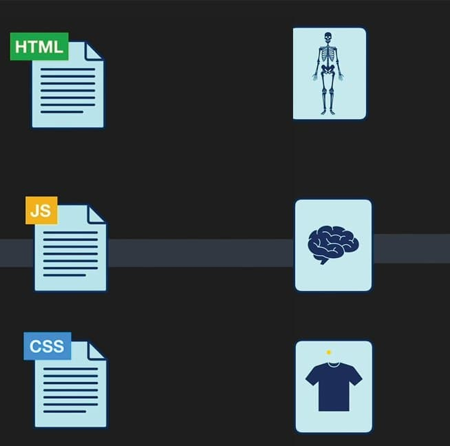

<div align="center">
  
  <p><strong>Roadmap to becoming a Front-End Developer in 2023.</strong></p>
</div>

---

<h1 align="center">:dart: Roadmap to boost your career</h1>

This is an organized guide to turning into an expert Front-end Engineer that anybody could use to find out about the act of front-end improvement.

---

<h3 align="center">Link icons:</h3>
<p align="center">📖 → Official Docs &nbsp; | &nbsp; 🎬 → Video &nbsp;</p>
<p align="center">📄 → Article &nbsp; | &nbsp; 🎬📃🎬 → Course</p>
<p align="center">
   → Personal Recommendation 
</p>
<p align="center">
   → YT Arabic Playlist; 
</p>
<p align="center">
   → English Playlist
</p>

<div align="center">
  <table>
    <thead align="center">
      <tr>
        <td colspan="3"><b>🗺️ Content</b></td>
      </tr>
    </thead>
    <tbody>
      <tr>
        <td>
          <a href="#introduction"><b>1-Introduction</b></a>
        </td>
        <td>
          <a href="#before-you-start"><b>2-Before you start</b></a>
        </td>
        <td>
          <a href="#front-end-development-techspec-overview"><b>3-Front-end Development Tech/Spec Overview &nbsp; </b></a>
        </td>
      </tr>
      <tr>
        <td>
          <a href="#required-for-any-path"><b>4-Required for any path</b></a>
        </td>
        <td>
          <a href="#basic-tools"><b>5-Basic tools</b></a>
        </td>
        <td>
          <a href="#level-one"><b>6-Level One (HTML, CSS, JS)</b> ✨</a>
        </td>
      </tr>
      <tr>
        <td>
          <a href="#level-two"><b>7-Level Two</b> ✨</a>
        </td>
        <td>
          <a href="#level-three"><b>8-Level Three</b> ✨</a>
        </td>
        <td>
          <a href="#what-next"><b>9-What Next?!</b></a>
        </td>
      </tr>
    </tbody>
  </table>

    <br />
  
  <div>
    
    <p>
      <strong>
        Any sources included in this roadmap are personal recommendations. You can choose one or more sources if you wish, or you can search for other sources.
      </strong>
    </p>
  </div>
</div>

---

# Introduction:

Front-end development involves using HTML, CSS, and JavaScript to build a client-side application. The client-side of an online application is the visual part of a web application and also what a user interacts with when an application is opened: colours, fonts, buttons, navigations, animations, etc.

[Introduction To Front End &nbsp; 🎬](https://youtu.be/6meCVoEo18o) &nbsp; 

Front-end development includes the user interface of an application. Everything a user interacts with when a user visits a website such as a login or sign-up page, homepage, contact page falls under the front-end development term.

A front-end developer is responsible for building and implementing the interface of a website or web application. They build client-side applications using web technologies such as HTML, CSS, and JavaScript.

In 2021 however, front-end development has gone beyond HTML, CSS, and JavaScript. There are a lot of web technologies you need to learn to be able to excel as a front-end developer this year.

> I will endeavor to cover all you need to get started with front-end development in 2023.

# Before you start:

First, you should read about [The Front-end Developer Profession &nbsp; 📄 ](https://frontendmasters.com/guides/learning-roadmap/front-end-developer-profession/)

## After this section, you should know:

- Front-end Developer Role
- Required Skills
- Job Titles

---

# Front-end Development Tech/Spec Overview

## In this section, you will learn about *Internet* and should know:

- The World Wide Web (aka WWW)
- Internet Fundamentals &  How it Works
- Hypertext Transfer Protocol (aka HTTP)
- Uniform Resource Locators (aka URL)
- Browsers and How The Web Works
- DNS, Domain Name and Hosting

<br />

## Here are some resources:

> skip what you already familiar with :handshake:

- [The Front-end Development Tech/Spec Overview &nbsp; 📄](https://frontendmasters.com/guides/learning-roadmap/front-end-development-overview/)
- [World Wide Web (WWW) Basic Mechanics &nbsp; 📄](https://frontendmasters.com/guides/learning-roadmap/www-basic-mechanics/)
- How does the Internet work?
  - [How does the Internet work? &nbsp; 📄](https://developer.mozilla.org/en-US/docs/Learn/Common_questions/How_does_the_Internet_work)
  - [The Internet Explained &nbsp; 📄](https://www.vox.com/2014/6/16/18076282/the-internet) 
  - [How the Internet Works in 5 Minutes &nbsp; 🎬 ](https://youtu.be/7_LPdttKXPc)
  - [How Does the Internet Work? &nbsp; 📄](https://web.stanford.edu/class/msande91si/www-spr04/readings/week1/InternetWhitepaper.htm)
  - [How The Web Works &nbsp; 📄](https://academind.com/tutorials/how-the-web-works)
- What is HTTP?
  - [What is HTTP? &nbsp; 📄](https://www.cloudflare.com/en-gb/learning/ddos/glossary/hypertext-transfer-protocol-http/)
  - [How HTTPS Works? &nbsp; 📄](https://howhttps.works/)
  - [An overview of HTTP &nbsp; 📄](https://developer.mozilla.org/en-US/docs/Web/HTTP/Overview)
  - [HTTP Messages - MDN 📄](https://developer.mozilla.org/en-US/docs/Web/HTTP/Messages)
  - [HTTP Crash Course & Exploration 🎬](https://youtu.be/iYM2zFP3Zn0)
  - [HTTP/3 From A To Z: Core Concepts](https://www.smashingmagazine.com/2021/08/http3-core-concepts-part1/)
  - [HTTP & Web Sockets &nbsp; 📄](https://frontendmasters.com/guides/learning-roadmap/http/)
- How Browsers Work?
  - [How Browsers Work &nbsp; 📄](https://web.dev/howbrowserswork/)
  - [What is a web browser? &nbsp; 📄](https://www.mozilla.org/en-US/firefox/browsers/what-is-a-browser/)
  - [How Do Web Browsers Work? &nbsp; 🎬](https://www.youtube.com/watch?v=WjDrMKZWCt0)
  - [Role of Rendering Engine in Browsers &nbsp; 📄](https://www.browserstack.com/guide/browser-rendering-engine)
  - [How Browsers Work &nbsp; 📄](https://www.freecodecamp.org/news/web-application-security-understanding-the-browser-5305ed2f1dac/)
- DNS and how it works?
  - [What is DNS? &nbsp; 📄](https://www.cloudflare.com/learning/dns/what-is-dns/)
  - [What is DNS? &nbsp; 📄](https://aws.amazon.com/route53/what-is-dns/)
  - [Mess with DNS - DNS Playground &nbsp; 🎮](https://messwithdns.net/)
  - [DNS and How does it work? &nbsp; 🎬](https://youtu.be/Wj0od2ag5sk)
  - [DNS Records for Newbies - How To Manage Website Records &nbsp; 🎬](https://youtu.be/YV5tkQYcvfg)
- Domain Name
  - [What is a domain name? &nbsp; 📄](https://www.cloudflare.com/learning/dns/glossary/what-is-a-domain-name/)
  - [What is a Domain Name? - MDN &nbsp; 📄](https://developer.mozilla.org/en-US/docs/Learn/Common_questions/Web_mechanics/What_is_a_domain_name)
  - [What is a Domain Name? - A Beginners Guide to How Domain Names Work! &nbsp; 🎬](https://youtu.be/Y4cRx19nhJk)

---

# Required for any path:

There are some tools required for any path such as Basic Terminal Usage (Command line), Git - Version Control & Github.

`Note:`

> **Learn these tools in parallel with the rest of the courses**.

## Basic Terminal Usage (Command line)

The terminal is an interface used to execute text commands, and it gives you access to the underlying operating system. Basic terminal usage is a skill all developers need regardless of their specialization. Command line is very important so I strongly recommend you study more on how to use it.

> If you are on windows like me, I recommend using [git bash](https://git-scm.com/downloads).

**Here are some resources to learn command line:**

- [Learn Command Line &nbsp; 🎬📃🎬 ](https://www.youtube.com/playlist?list=PLDoPjvoNmBAxzNO8ixW83Sf8FnLy_MkUT) 
- [Command Line Crash Course - Freecodecamp &nbsp; 🎬 ](https://youtu.be/yz7nYlnXLfE)
- [Command line crash course &nbsp; 📄 ](https://developer.mozilla.org/en-US/docs/Learn/Tools_and_testing/Understanding_client-side_tools/Command_line)

## Git - Version Control

Git is a version control system that enables developers to track changes in their project. Git also helps developers collaborate as a team. Git is needed among developers, to ensure that there are no code conflicts between developers.

## Github

GitHub is a code hosting platform for software development. GitHub lets teams work together on projects and it is also used for version control. It can be used among teams to collaborate on a project. For example, a team of developers wants to build a web application and everyone is given a task that has to be updated daily while working on the project, in this case, Github helps them build a centralized repository where each team member can make updates or manage the code file or repository.

<br />

**Here are some resources to learn Git & GitHub:**

- [Git Handbook - Github guides &nbsp; 📄 ](https://guides.github.com/introduction/git-handbook/)
- [Git Videos &nbsp; 🎬📃🎬 ](https://git-scm.com/videos)
- [Git Cheat Sheet repo 📄](https://github.com/FADL285/git-cheat-sheet)
- [Git book - Git &nbsp; 📄 ](https://git-scm.com/book/en/v2)
- [Github Guides &nbsp; 📄 ](https://guides.github.com/activities/hello-world/)
- [Version Control with Git - Udacity &nbsp; 🎬📃🎬 ](https://www.udacity.com/course/version-control-with-git--ud123)
- [Introduction to Git and GitHub from Google &nbsp; 🎬📃🎬 ](https://www.coursera.org/learn/introduction-git-github)
- [An introduction to Git - Freecodecamp &nbsp; 📄 ](https://www.freecodecamp.org/news/what-is-git-and-how-to-use-it-c341b049ae61/)
- [Git & GitHub Arabic Tutorial &nbsp; 🎬📃🎬](https://www.youtube.com/playlist?list=PLqPejUavRNTXejD5npdmFbe6NU6dTJLhW) 
- [Learn Git and GitHub &nbsp; 🎬📃🎬 ](https://www.youtube.com/playlist?list=PLDoPjvoNmBAw4eOj58MZPakHjaO3frVMF) 
- [learn Git in Arabic &nbsp; 🎬📃🎬](https://www.youtube.com/playlist?list=PLfDx4cQoUNOYVfQs_NFNyykcqkaJ_plmK) 
- [Git Tutorial for Beginners: Learn Git in 1 Hour - Code with Mosh &nbsp; 🎬 ](https://youtu.be/8JJ101D3knE)
- [Git and GitHub for Beginners - Crash Course - Freecodecamp &nbsp; 🎬 ](https://youtu.be/RGOj5yH7evk)

---

# Basic tools

<div align="center">
  <p>Basic tools to get start.</p>

  <table>
    <thead align="center">
      <tr>
        <td><b>Text Editor :writing_hand:</b></td>
        <td><b>Browser :globe_with_meridians:</b></td>
        <td><b>:man_technologist: Terminal</b></td>
      </tr>
    </thead>
    <tbody>
      <tr>
        <td><a href="https://code.visualstudio.com/" target="_blank"><b>VS Code :ballot_box_with_check:</b></a></td>
        <td><a href="https://www.google.com/chrome/" target="_blank"><b>Google Chrome :ballot_box_with_check:</b></a></td>
        <td><a href="https://git-scm.com/downloads" target="_blank"><b>Git Bash :ballot_box_with_check:</b></a></td>
      </tr>
      <tr>
        <td><a href="https://atom.io/" target="_blank"><b>Atom</b></a></td>
        <td><a href="https://www.microsoft.com/en-us/edge" target="_blank"><b>Microsoft Edge</b></a></td>
        <td><a href="https://cmder.net/" target="_blank"><b>Cmder</b></a></td>
      </tr>
      <tr>
        <td><a href="https://www.jetbrains.com/webstorm/" target="_blank"><b>WebStorm</b></a></td>
        <td><a href="https://www.mozilla.org/en-US/firefox/new/" target="_blank"><b>Mozilla Firefox</b></a></td>
        <td><a href="https://hyper.is/" target="_blank"><b>Hyper</b></a></td>
      </tr>
    </tbody>
  </table>

  [Code Editors resources 📄](https://frontendmasters.com/guides/learning-roadmap/code-editors/)

</div>

---

# Level One:

<div align="center">
  <table>
    <thead align="center">
      <tr>
        <td colspan="3"><b>🗺️ Content</b></td>
      </tr>
    </thead>
    <tbody>
      <tr>
        <td>
          <a href="#html"><b>1- HTML</b></a>
        </td>
        <td>
          <a href="#css"><b>2- CSS</b></a>
        </td>
        <td>
          <a href="#html--css---resources--practice"><b>3- HTML & CSS - (resources & practice)</b></a>
        </td>
      </tr>
      <tr>
        <td colspan="2">
          <a href="#javascript"><b>4- JavaScript</b></a>
        </td>
        <td>
          <a href="#accessibility"><b>5- Accessibility</b></a>
        </td>
      </tr>
    </tbody>
  </table>
</div>

<p align="center">
  
</p>

## HTML:

HTML stands for Hypertext Markup Language. It is the markup language for building web pages, it is also the building block of the web. HTML is easy to learn and comprehend. With just HTML, you can build a basic website.

**Here are some resources to learn HTML:**

- [Learning resources and tools for HTML - Front-End Masters 📄](https://frontendmasters.com/guides/learning-roadmap/html/) ✨💫
- [Learn HTML - Elzero Web School 📄](https://elzero.org/learn-html/) ✨💫
  - [Learn HTML In Arabic 2021 🎬📃🎬](https://www.youtube.com/playlist?list=PLDoPjvoNmBAw_t_XWUFbBX-c9MafPk9ji) 
  - [HTML Study Plan 📄](https://elzero.org/study/html-2021-study-plan/)
  - [HTML Assignments 📄](https://elzero.org/category/assignments/html-assignments/)
- [MDN - HTML 📄](https://developer.mozilla.org/en-US/docs/Learn/HTML)
- [Learn HTML - web.dev 📄](https://web.dev/learn/html/) `recommended`
- [Learn Forms - web.dev 📄](https://web.dev/learn/forms/) `recommended`
- [HTML Full Course - Freecodecamp 🎬](https://youtu.be/pQN-pnXPaVg)
- [HTML Crash Course For Absolute Beginners - Traversy Media 🎬](https://www.youtube.com/watch?v=UB1O30fR-EE)

> For writing maintainable and scalable HTML documents, check this repo [HTML Best Practices](https://github.com/hail2u/html-best-practices)

---

## CSS:

CSS stands for Cascading Style Sheets. It is the technology to learn after HTML. It is used for styling our HTML. For example, we can use CSS to space our content, colours, fonts, etc.

**Here are some resources to learn CSS:**

- [Learn CSS - Elzero Web School 📄](https://elzero.org/learn-css/) ✨💫
    - [Learn CSS In Arabic 2021 🎬📃🎬](https://www.youtube.com/playlist?list=PLDoPjvoNmBAzjsz06gkzlSrlev53MGIKe) 
    - [CSS Study Plan 📄](https://elzero.org/study/css-2021-study-plan/)
    - [CSS Assignments 📄](https://elzero.org/category/assignments/css-assignments/)
- [MDN - CSS 📄](https://developer.mozilla.org/en-US/docs/Learn/CSS)
- [Web.dev - Learn CSS 📄](https://web.dev/learn/css/) ```recommended```
- [Web.dev - Learn Responsive Design 📄](https://web.dev/learn/design/) ```recommended```

> 💡 Take a look at this repository - [Awesome-CSS-Learning](https://github.com/FADL285/Awesome-CSS-Learning) - A tiny list limited to the best CSS Learning Resources.

<br />

**The basics of CSS you need to learn are:**

- Basics, Box Model, Colors & Gridents, Units :arrow_right: [CSS Fundamentals 📄](https://frontendmasters.com/guides/learning-roadmap/css-fundamentals)
- Flow, Positioning, Floats, Flex box, Grids :arrow_right: [CSS Layout 📄](https://frontendmasters.com/guides/learning-roadmap/css-layout/)
- Responsive Design & Media Queries :arrow_right: [CSS Media Queries 📄](https://frontendmasters.com/guides/learning-roadmap/css-media-queries/)
- Animations :arrow_right: [CSS Transitions, Transforms & Animation 📄](https://frontendmasters.com/guides/learning-roadmap/css-transitions-transforms-animations/)
- Web Fonts, CSS Icons, Google Fonts :arrow_right: [CSS Fonts & Icons 📄](https://frontendmasters.com/guides/learning-roadmap/css-fonts-and-icons/)
- CSS Variables & CSS Practices :arrow_right: [CSS Practices 📄](https://frontendmasters.com/guides/learning-roadmap/css-practices/)

---

## HTML & CSS - (Resources & Practice)

In this section, I will recommend some paid courses and YouTubevideos that explain and build websites using HTML and CSS.
Plus some websites to practice what you've learned.

**Here are some Paid Courses for HTML & CSS:** 🎬📃🎬 :dollar::dollar: 

- [Build Responsive Real-World Websites with HTML and CSS](https://www.udemy.com/course/design-and-develop-a-killer-website-with-html5-and-css3/)
- [Modern HTML & CSS From The Beginning (Including Sass)](https://www.udemy.com/course/modern-html-css-from-the-beginning/) :arrow_right: `exclude sass from it now`
- [CSS - The Complete Guide 2021 (incl. Flexbox, Grid & Sass)](https://www.udemy.com/course/css-the-complete-guide-incl-flexbox-grid-sass/) :arrow_right: `exclude sass from it now`

<br />

**Here are some YouTubeVideos for building templates with HTML & CSS:** 

- [Practical HTML & CSS - Elzero Web School 📄](https://elzero.org/practical-html-css/)
    - [HTML And CSS Template 1 🎬📃🎬](https://www.youtube.com/playlist?list=PLDoPjvoNmBAzHSjcR-HnW9tnxyuye8KbF) 
    - [HTML And CSS Template 2 🎬📃🎬](https://www.youtube.com/playlist?list=PLDoPjvoNmBAy1l-2A21ng3gxEyocruT0t) 
    - [HTML And CSS Template 3 🎬📃🎬](https://www.youtube.com/playlist?list=PLDoPjvoNmBAxuCSp2_-9LurPqRVwketnc) 
- [Design Template Using ( HTML 5 - CSS 3 ) - Unique Coderz Academy 🎬📃🎬](https://www.youtube.com/playlist?list=PLtFbQRDJ11kFq3C3I7sKHjXbFru4rx8qs) 
- [Design Responsive Template Using ( HTML - CSS - Media Query ) - Unique Coderz Academy 🎬📃🎬](https://www.youtube.com/playlist?list=PLtFbQRDJ11kG7W2TmVs4gr9FqmZ0Ui551) 
- [Traversy Media](https://www.youtube.com/channel/UC29ju8bIPH5as8OGnQzwJyA)
    - [Build a Responsive Website | HTML, CSS Grid, Flexbox & More 🎬](https://youtu.be/p0bGHP-PXD4)
    - [Build a Modern Landing Page Website | HTML & CSS 🎬](https://youtu.be/X1dz0xRbSJc)
    - [Build An HTML5 Website With A Responsive Layout 🎬](https://youtu.be/Wm6CUkswsNw)
    - [Pluralsight Login Page Clone - HTML & CSS 🎬](https://youtu.be/wIx1O5Y5EB4)
- [How To Make Website Using HTML & CSS | Full Responsive - Easy Tutorials 🎬📃🎬](https://youtu.be/oYRda7UtuhA)

<br />

- [ Frontend Masters Web Development Bootcamp ](https://frontendmasters.com/bootcamp/) -> ```included JS```

<br />
